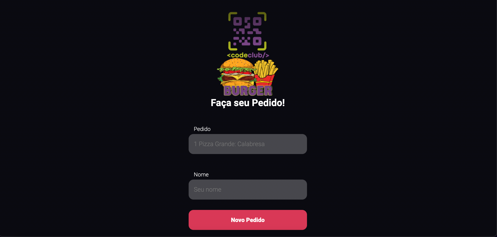

# Burguer App 

Esse projeto foi feito com muito amor feito com 

Projeto com intuito de colocar em prática os conheciementos de rotas, em NODE, React utilizando <em>Styled Components</em> para estilizar. 

# Projeto 

Esse projeto foi desafiador mas com bastante conhecimentos. Além disso, todos os conhecimentos adquiridos até aqui foram postos a prova.

O projeto é simple, onde você cadastra os pedidos e em uma segunda tela aparece os pedidos cadastrados. É possivel excluir pedidos e adicionar um novo.

